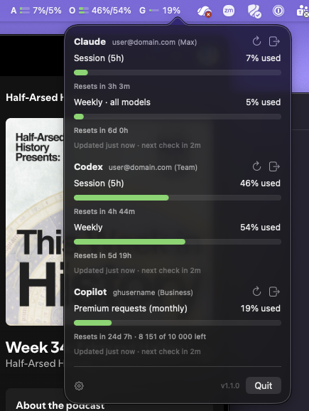
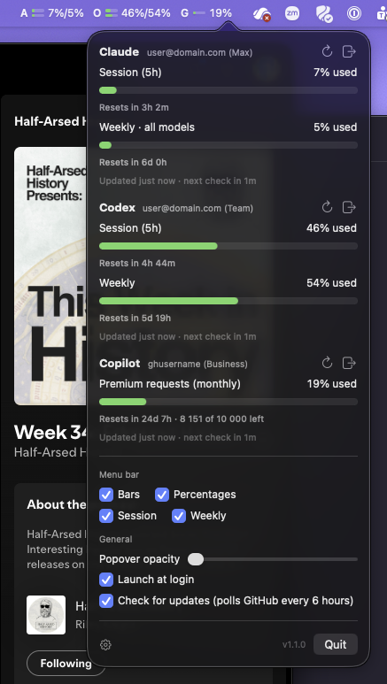

# Range Anxiety

[](https://github.com/headconnect/range-anxiety/releases/latest)
[](LICENSE)

macOS menu bar app showing your Claude, Codex and GitHub Copilot plan usage
with reset countdowns: the 5-hour session and weekly windows for Claude and
Codex, the monthly premium-request quota for Copilot. It reads the same numbers
as the usage pages on claude.ai, chatgpt.com and github.com.

Menu bar: `A ▤ 12%/4%  O ▤ 77%/47%  G ▤ 18%`, one entry per signed-in account,
tagged by vendor unless you rename it (Anthropic, OpenAI, GitHub): a mini bar per
limit and the percentages, short-term window first (session/weekly). Bars turn
orange at 70 % and red at 90 %.



## Requirements

- macOS 14 or later
- Any of: a Claude Pro/Max/Team account, a ChatGPT account with Codex, a GitHub account with Copilot

## Install

Download the latest DMG from [Releases](https://github.com/headconnect/range-anxiety/releases/latest),
open it, and drag Range Anxiety into the Applications folder shown next to it. It's
signed and notarized, so Gatekeeper lets it run without extra steps. Then open
it from Applications or Spotlight; it appears in the menu bar, not the Dock.

Or with [Homebrew](https://brew.sh):

```sh
brew install headconnect/tap/range-anxiety
```

Tick "Launch at login" in the [settings](#settings) to keep it running.

### Build from source

Needs a Swift 5.10+ toolchain (Xcode Command Line Tools are enough):

```sh
make install   # builds "build/Range Anxiety.app" and copies it to /Applications
open "/Applications/Range Anxiety.app"
```

`make run` builds and launches without installing.

## Sign in

Add an account first — in the [settings](#settings), or from the popover while
it is empty — then sign in to it. Several accounts of the same provider are
fine; each gets its own menu bar tag. Tokens for all of them live in a single
login keychain item (service `no.enso.range-anxiety`, account `accounts`) and are
refreshed automatically. The app was called headroom up to 2.0; the first
launch under this name moves its vault, settings and account list over (or the
1.x per-provider items) and then deletes them. Release builds share the old
signing identity, so that is silent; a locally built app prompts once per item.

**Claude.** Click *Sign in to Claude*. Your browser opens claude.ai; after you
authorize, Anthropic shows a code and tells you to paste it into Claude Code.
Paste it into Range Anxiety instead and press *Continue*.

**Codex.** Click *Sign in to Codex*. Your browser opens auth.openai.com and
redirects back to `http://localhost:1455` when done. Nothing to paste.

**Copilot.** Click *Sign in to Copilot*. Range Anxiety shows an 8-character code
(with a copy button; it is also put on your clipboard) and opens
github.com/login/device. Enter the code there; Range Anxiety picks up the token by
itself.

**Privately.** The arrow next to a sign-in button runs the same flow in a window
that shares no cookies with your browser, so a second account of a provider is
not signed straight back in as the first. Only one account can be signing in at
a time; *Cancel* in the popover ends it, closing the window does not.

Sign out with the door icon next to an account. Signing out deletes its stored
tokens, and so does removing the account.

## Settings

The gear at the bottom of the popover opens the settings window; the plus next
to it adds an account without going there.



**Accounts.** One row per account, in menu bar order; the chevrons move it.
The photo button picks an image to show instead of the tag. The tag itself is
up to 3 characters, emoji count as one, and left empty falls back to the
provider's letter. Then an optional name such as "Office", and a trash button
that removes the account and forgets its tokens. *Customise menu bar* gives
that account its own copy of the toggles below; unticking it follows the
global ones again.

**Global Default Menu Bar Appearance.** Defaults for accounts without their own. *Bars* and *Percentages*
choose how each account is shown; at least one stays on. *Session* and *Weekly*
choose which limits are shown, for providers that have both. Copilot has a
single quota and always shows it.

**General.** *Popover opacity* runs from 30 % to fully opaque; the popover
is translucent by default, and this keeps it readable over light windows.
*Launch at login* registers the app with macOS. *Check for updates* is off by
default; when on, Range Anxiety asks GitHub for the latest release every 6 hours
and shows a link in the footer when it is newer than the running version.
Nothing is downloaded or installed automatically.

Settings are stored in the app's user defaults (`no.enso.range-anxiety`), the
account list included — tags and names only, never tokens.

## Refresh behaviour

Each account has its own schedule.

| Situation | Next check |
|---|---|
| Default | 5 min |
| Numbers changed since last check | 2 min |
| Unchanged | doubles: 5 → 10 → 20 min (cap) |
| A window is about to reset | shortly after the reset |
| Rate limited (HTTP 429) | 20 min |
| Manual refresh (↻) | now, then back to 5 min |

The popover footer under each account shows when it was last updated and when
the next check is due.

## How it works

All three providers expose the usage numbers behind an OAuth token:

- Claude: `GET https://api.anthropic.com/api/oauth/usage`, the endpoint Claude
  Code uses for `/usage`. Sign-in is the same PKCE flow as Claude Code.
- Codex: `GET https://chatgpt.com/backend-api/wham/usage`, the endpoint the
  Codex CLI uses. Sign-in is the same PKCE flow as `codex login`.
- Copilot: `GET https://api.github.com/copilot_internal/user`, the endpoint the
  Copilot editor extensions use. Sign-in is GitHub's device flow with the
  Copilot app's client id. Unlimited quotas (chat, completions on most plans)
  are hidden; the metered premium-request quota is shown with counts.

These endpoints are not publicly documented, so field names may change. The
Claude parser accepts any limit key that carries a `utilization` value; unknown
keys are shown only when they have a reset time.

The app talks only to anthropic.com, claude.ai, openai.com, chatgpt.com and
github.com. With "Check for updates" on (off by default) it also asks
api.github.com for this repository's latest release every 6 hours and shows a
link in the popover when it is newer than the running version.

## Release

`make release` builds `build/range-anxiety-<version>.dmg`: the app and an
Applications shortcut over `Resources/dmg-background.tiff`, laid out by Finder
via `scripts/dmg-layout.applescript`. The icon and background are drawn by
`scripts/artwork.swift`; `make artwork` regenerates them. To make it installable
on other Macs it must be signed with a Developer ID and notarized. The script
uses the Developer ID Application identity in your keychain if there is one;
set `SIGN_IDENTITY` to choose explicitly. Notarization runs when
`NOTARY_PROFILE` is set:

```sh
NOTARY_PROFILE=range-anxiety make release
```

One-time setup with an Apple Developer account:

1. Create a *Developer ID Application* certificate at
   developer.apple.com/account/resources/certificates. Generate the signing
   request in Keychain Access (Certificate Assistant → Request a Certificate
   From a Certificate Authority), upload it, download the certificate and
   double-click it. `security find-identity -v -p codesigning` then lists it.
2. Create an app-specific password at account.apple.com and store it:
   ```sh
   xcrun notarytool store-credentials range-anxiety \
       --apple-id you@example.com --team-id TEAMID
   ```

Without `SIGN_IDENTITY` the DMG is ad-hoc signed and only runs on the building
Mac. Signing with a Developer ID also stops the keychain prompt after rebuilds.

### GitHub Actions

`.github/workflows/release.yml` does the same on a macOS runner, on every
`v*` tag (attaching the DMG to a GitHub Release) or by hand from the Actions
tab (DMG as a build artifact). A tag `v1.2` produces `range-anxiety-1.2.dmg`
with that version stamped into the app; manual runs use the version in
`Resources/Info.plist`. After a tagged release it also bumps the cask in
[headconnect/homebrew-tap](https://github.com/headconnect/homebrew-tap) via
`scripts/bump-cask.sh`, when `TAP_GITHUB_TOKEN` is set. It needs these
repository secrets:

| Secret | Value |
|---|---|
| `MACOS_CERTIFICATE_P12` | Developer ID identity exported as PKCS#12, base64-encoded |
| `MACOS_CERTIFICATE_PASSWORD` | password of that PKCS#12 file |
| `NOTARY_APPLE_ID` | Apple ID email of the developer account |
| `NOTARY_PASSWORD` | app-specific password for that Apple ID |
| `TAP_GITHUB_TOKEN` | fine-grained PAT with *Contents: read and write* on `headconnect/homebrew-tap` (optional) |

Export the identity from Keychain Access (right-click the certificate →
Export) or with `security export -t identities -f pkcs12`, then
`base64 -i cert.p12 | gh secret set MACOS_CERTIFICATE_P12`.

## Development

```sh
make build   # debug build
make test    # checks: refresh policy, response parsing, PKCE, accounts (no Xcode needed)
make app     # release build + app bundle in build/
make release # DMG, signed and notarized when SIGN_IDENTITY/NOTARY_PROFILE are set
make artwork # regenerate Resources/range-anxiety.icns and the DMG background
swift run RangeAnxietyChecks --live   # also fetch and print usage for signed-in accounts
```

Layout:

```
Sources/RangeAnxietyCore/
  Model/       Provider, Account, MenuBarOptions, UsageWindow/UsageSnapshot, OAuthTokens, errors
  Auth/        PKCE, JWT claims, keychain vault + migration, localhost callback server, private sign-in window
  Providers/   ClaudeService, CodexService, CopilotService, shared HTTP helpers
  Scheduler/   RefreshPolicy (pure), AccountStore (accounts + vault), AccountMonitor (state + polling loop)
  UI/          status item + popover (App), menu bar label, per-account section, settings, formatting
Sources/range-anxiety/        main.swift, launches the app
Sources/RangeAnxietyChecks/  check runner used by `make test`
```

Development builds are ad-hoc signed, so each build has a new signature and
macOS may ask for keychain access once after rebuilding; choose *Always Allow*.

## Contributing

See [CONTRIBUTING.md](CONTRIBUTING.md) before opening a PR.

## License

[MIT](LICENSE)

## AI disclosure

See [AI_DISCLOSURE.md](AI_DISCLOSURE.md).
