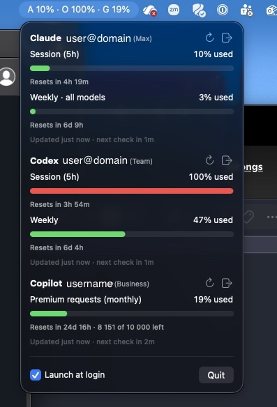

# headroom

[](https://github.com/headconnect/headroom/releases/latest)
[](LICENSE)

macOS menu bar app showing your Claude, Codex and GitHub Copilot plan usage
with reset countdowns: the 5-hour session and weekly windows for Claude and
Codex, the monthly premium-request quota for Copilot. It reads the same numbers
as the usage pages on claude.ai, chatgpt.com and github.com.

Menu bar title: `A 12% · O 77% · G 18%`, the peak utilisation per provider,
tagged by vendor (Anthropic, OpenAI, GitHub).



## Requirements

- macOS 14 or later
- Any of: a Claude Pro/Max/Team account, a ChatGPT account with Codex, a GitHub account with Copilot

## Install

Download the latest DMG from [Releases](https://github.com/headconnect/headroom/releases/latest),
open it, and drag headroom.app to Applications. It's signed and notarized, so
Gatekeeper lets it run without extra steps.

Tick "Launch at login" in the popover to keep it running.

### Build from source

Needs a Swift 5.10+ toolchain (Xcode Command Line Tools are enough):

```sh
make install   # builds build/headroom.app and copies it to /Applications
open /Applications/headroom.app
```

`make run` builds and launches without installing.

## Sign in

Each provider is signed in separately. Tokens are stored in your login keychain
under the service `no.enso.headroom` and refreshed automatically.

**Claude.** Click *Sign in to Claude*. Your browser opens claude.ai; after you
authorize, Anthropic shows a code. Paste it into the widget and press *Continue*.

**Codex.** Click *Sign in to Codex*. Your browser opens auth.openai.com and
redirects back to `http://localhost:1455` when done. Nothing to paste.

**Copilot.** Click *Sign in to Copilot*. The widget shows an 8-character code
(also copied to your clipboard) and opens github.com/login/device. Enter the
code there; the widget picks up the token by itself.

Sign out with the door icon next to a provider. Signing out deletes the stored
tokens.

## Refresh behaviour

Each provider has its own schedule.

| Situation | Next check |
|---|---|
| Default | 5 min |
| Numbers changed since last check | 2 min |
| Unchanged | doubles: 5 → 10 → 20 min (cap) |
| A window is about to reset | shortly after the reset |
| Rate limited (HTTP 429) | 20 min |
| Manual refresh (↻) | now, then back to 5 min |

The popover footer under each provider shows when it was last updated and when
the next check is due.

## How it works

Both providers expose the usage numbers behind an OAuth token:

- Claude: `GET https://api.anthropic.com/api/oauth/usage`, the endpoint Claude
  Code uses for `/usage`. Sign-in is the same PKCE flow as Claude Code.
- Codex: `GET https://chatgpt.com/backend-api/wham/usage`, the endpoint the
  Codex CLI uses. Sign-in is the same PKCE flow as `codex login`.
- Copilot: `GET https://api.github.com/copilot_internal/user`, the endpoint the
  Copilot editor extensions use. Sign-in is GitHub's device flow with the
  Copilot app's client id. Unlimited quotas (chat, completions on most plans)
  are hidden; the metered premium-request quota is shown with counts.

These endpoints are not publicly documented, so field names may change. The
Claude parser accepts any limit key that carries a `utilization` value; unknown
keys are shown only when they have a reset time.

The app talks only to anthropic.com, claude.ai, openai.com, chatgpt.com and github.com.

## Release

`make release` builds `build/headroom-<version>.dmg`. To make it installable
on other Macs it must be signed with a Developer ID and notarized. The script
uses the Developer ID Application identity in your keychain if there is one;
set `SIGN_IDENTITY` to choose explicitly. Notarization runs when
`NOTARY_PROFILE` is set:

```sh
NOTARY_PROFILE=headroom make release
```

One-time setup with an Apple Developer account:

1. Create a *Developer ID Application* certificate at
   developer.apple.com/account/resources/certificates. Generate the signing
   request in Keychain Access (Certificate Assistant → Request a Certificate
   From a Certificate Authority), upload it, download the certificate and
   double-click it. `security find-identity -v -p codesigning` then lists it.
2. Create an app-specific password at account.apple.com and store it:
   ```sh
   xcrun notarytool store-credentials headroom \
       --apple-id you@example.com --team-id TEAMID
   ```

Without `SIGN_IDENTITY` the DMG is ad-hoc signed and only runs on the building
Mac. Signing with a Developer ID also stops the keychain prompt after rebuilds.

### GitHub Actions

`.github/workflows/release.yml` does the same on a macOS runner, on every
`v*` tag (attaching the DMG to a GitHub Release) or by hand from the Actions
tab (DMG as a build artifact). A tag `v1.2` produces `headroom-1.2.dmg`
with that version stamped into the app; manual runs use the version in
`Resources/Info.plist`. It needs four repository secrets:

| Secret | Value |
|---|---|
| `MACOS_CERTIFICATE_P12` | Developer ID identity exported as PKCS#12, base64-encoded |
| `MACOS_CERTIFICATE_PASSWORD` | password of that PKCS#12 file |
| `NOTARY_APPLE_ID` | Apple ID email of the developer account |
| `NOTARY_PASSWORD` | app-specific password for that Apple ID |

Export the identity from Keychain Access (right-click the certificate →
Export) or with `security export -t identities -f pkcs12`, then
`base64 -i cert.p12 | gh secret set MACOS_CERTIFICATE_P12`.

## Development

```sh
make build   # debug build
make test    # checks: refresh policy, response parsing, PKCE (no Xcode needed)
make app     # release build + app bundle in build/
make release # DMG, signed and notarized when SIGN_IDENTITY/NOTARY_PROFILE are set
swift run HeadroomChecks --live   # also fetch and print usage for signed-in providers
```

Layout:

```
Sources/HeadroomCore/
  Model/       Provider, UsageWindow/UsageSnapshot, OAuthTokens, errors
  Auth/        PKCE, JWT claims, keychain store, localhost callback server
  Providers/   ClaudeService, CodexService, CopilotService, shared HTTP helpers
  Scheduler/   RefreshPolicy (pure), ProviderMonitor (state + polling loop)
  UI/          MenuBarExtra app, popover, per-provider section, formatting
Sources/headroom/        main.swift, launches the app
Sources/HeadroomChecks/  check runner used by `make test`
```

Development builds are ad-hoc signed, so each build has a new signature and
macOS may ask for keychain access once after rebuilding; choose *Always Allow*.

## Contributing

See [CONTRIBUTING.md](CONTRIBUTING.md) before opening a PR.

## License

[MIT](LICENSE)

## AI disclosure

See [AI_DISCLOSURE.md](AI_DISCLOSURE.md).
